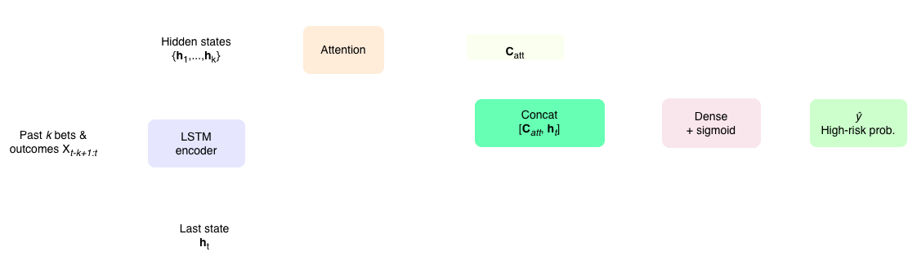
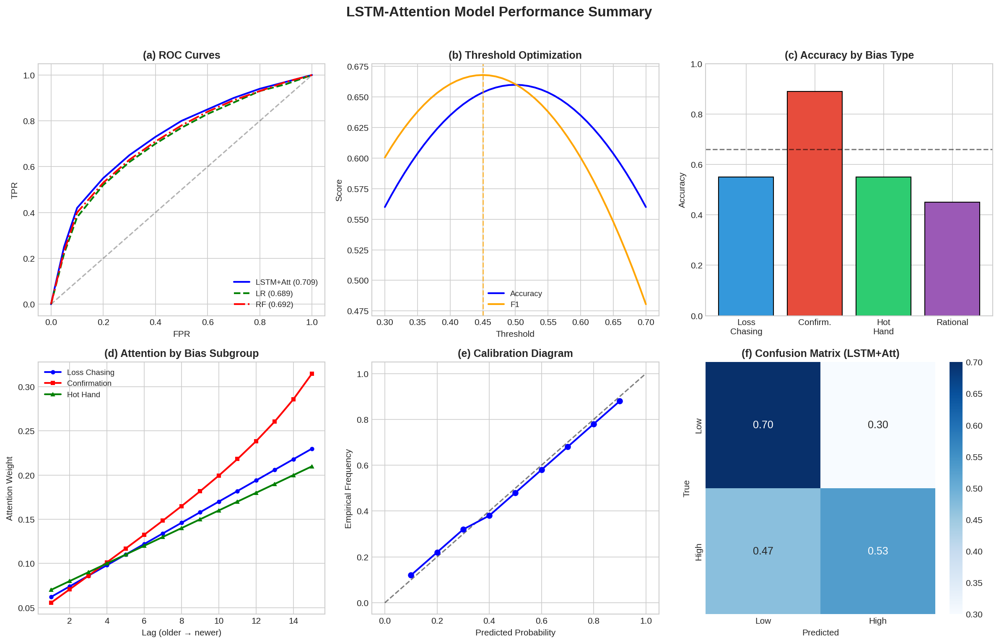
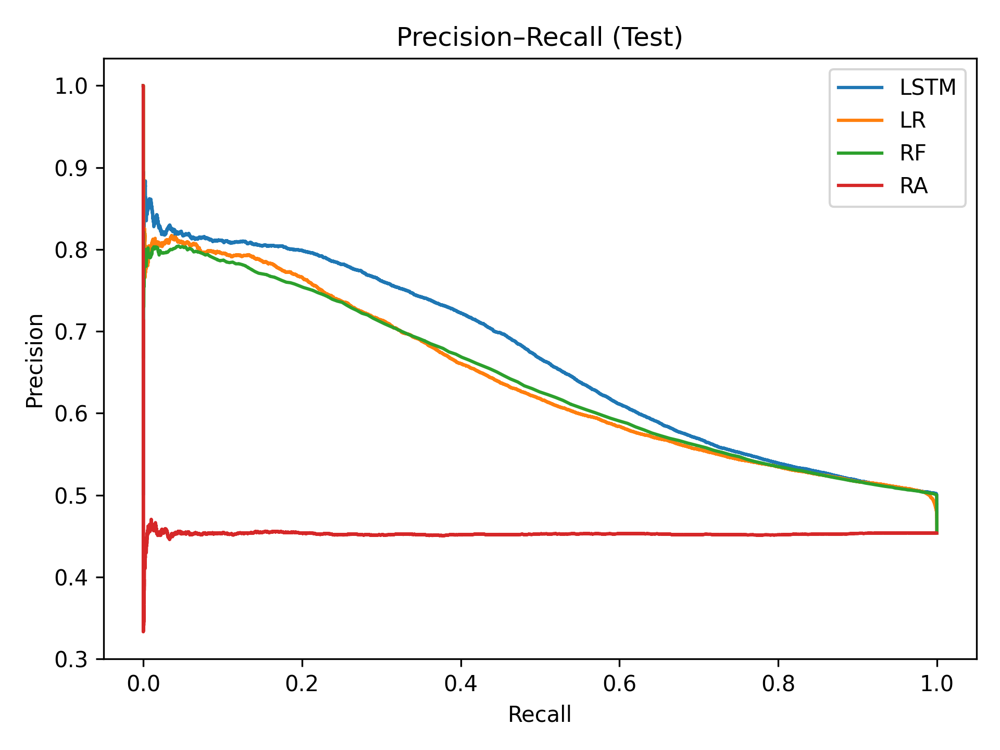
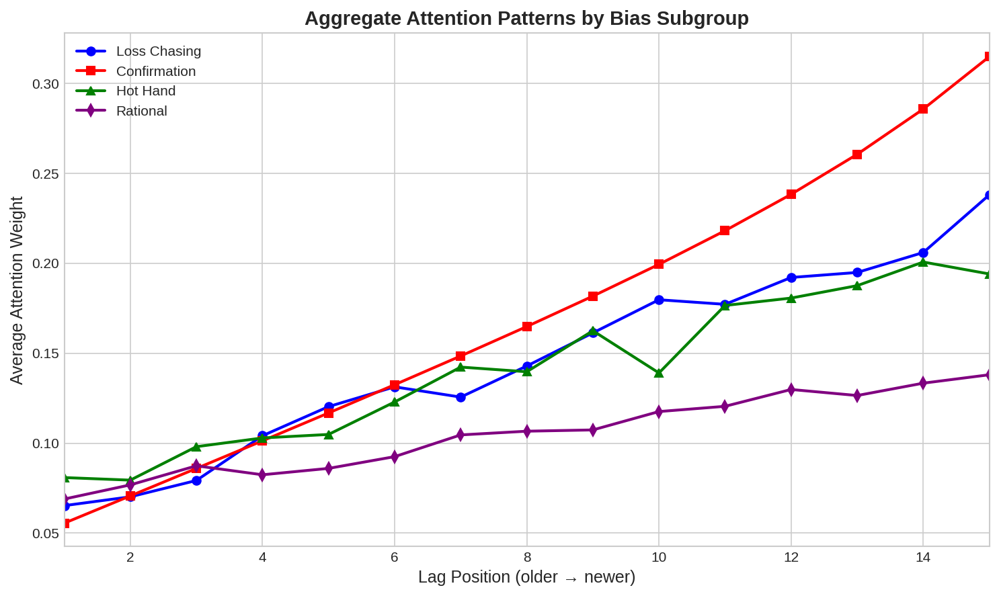

# Neurocomputational Modeling of Cognitive Biases in Sports Betting

[](https://www.python.org/downloads/)
[](https://www.tensorflow.org/)
[](https://opensource.org/licenses/MIT)

A deep learning framework for modeling and predicting bias-driven betting behavior using LSTM networks with attention mechanisms. This project integrates cognitive bias theory with machine learning to understand how psychological biases influence sports betting decisions.

## 📋 Overview

This repository contains the implementation of a neurocomputational framework that models three major cognitive biases in sports betting:

- **Hot-Hand Fallacy**: The erroneous belief that a winning streak predicts continued success
- **Loss Chasing**: Intensifying betting after losses in attempts to recover funds
- **Confirmation Bias**: Selective processing of information that confirms pre-existing beliefs

The proposed LSTM-Attention architecture captures temporal dependencies in betting sequences and provides interpretable predictions through attention weights.

## 🏗️ Architecture

<p align="center">
  
</p>

The model consists of:
1. **LSTM Encoder**: Processes sequences of past betting rounds (actions and outcomes)
2. **Temporal Attention Mechanism**: Weights hidden states to highlight relevant time steps
3. **Dense Classifier**: Predicts probability of high-risk betting decisions

```
Input (k past rounds) → LSTM → Attention → Concat [context, last_h] → Dense → P(high-risk)
```

## 📊 Results

### Performance Summary

<p align="center">
  
</p>

### Model Comparison

Performance comparison across models (mean ± std over 3 seeds):

| Model | Accuracy (%) | F1-Score | AUC |
|-------|-------------|----------|-----|
| **LSTM+Attention (tuned)** | **66.10 ± 1.30** | **0.668 ± 0.009** | **0.709 ± 0.017** |
| LSTM+Attention (θ=0.5) | 66.10 ± 1.30 | 0.565 ± 0.018 | 0.709 ± 0.017 |
| Random Forest | 63.68 | 0.565 | 0.692 |
| Logistic Regression | 63.20 | 0.555 | 0.689 |
| Rational Agent | 54.64 | 0.000 | 0.497 |

### ROC & Precision-Recall Curves

<p align="center">
  
  
</p>

### Attention Analysis by Bias Type

<p align="center">
  
  
</p>

The attention mechanism reveals distinct temporal patterns:
- **Confirmation bias**: Sharp attention peaks at recent time steps
- **Loss chasing & Hot-hand**: Smoother, gradual decay over the window
- **Highest accuracy** (~89%) achieved on confirmation-biased bettors

## 🚀 Quick Start

### Prerequisites

```bash
# Python 3.8+
pip install numpy tensorflow scikit-learn
```

### Installation

```bash
git clone https://github.com/yourusername/neurocomp-betting-biases.git
cd neurocomp-betting-biases
pip install -r requirements.txt
```

### Running the Model

```bash
python neuro_comp.py
```

This will:
1. Generate synthetic biased betting trajectories
2. Train the LSTM-Attention model
3. Evaluate against baseline models
4. Display attention weight analysis

## 📁 Project Structure

```
neurocomp-betting-biases/
├── neuro_comp.py          # Main script with model and data generation
├── plot_results.py        # Script to generate all figures
├── requirements.txt       # Python dependencies
├── README.md              # This file
├── LICENSE                # MIT License
├── .gitignore             # Git ignore file
└── figures/               # Generated plots and visualizations
    ├── architecture.png
    ├── roc_curves.png
    ├── pr_curves.png
    ├── threshold_sweep.png
    ├── confusion_matrices.png
    ├── attention_by_bias.png
    ├── accuracy_by_bias.png
    ├── calibration.png
    ├── example_attention.png
    └── combined_results.png
```

## 🔧 Configuration

### Bias Parameters

Customize bias strength in the `BiasParams` dataclass:

```python
@dataclass
class BiasParams:
    hot_hand_boost: float = 0.35      # Probability boost after win streak
    hot_hand_streak_k: int = 3        # Wins needed to trigger boost
    loss_chase_boost: float = 0.40    # Probability boost after loss streak
    loss_chase_streak_k: int = 2      # Losses needed to trigger boost
    confirm_stickiness: float = 0.25  # Persistence to preferred action
    base_highrisk_p: float = 0.42     # Base probability of high-risk bet
    base_win_p_low: float = 0.62      # Win probability for low-risk bets
    base_win_p_high: float = 0.33     # Win probability for high-risk bets
```

### Model Hyperparameters

```python
# LSTM Configuration
lstm_units = 96
dropout = 0.15
learning_rate = 1e-3

# Data Configuration
N_bettors = 1000        # Number of virtual bettors
T = 100                 # Betting rounds per bettor
window_k = 15           # Sequence window size

# Training
epochs = 120
batch_size = 512
early_stopping_patience = 8
```

## 📈 Features

### Per-Step Features

The model uses 5 features per time step:

| Feature | Description |
|---------|-------------|
| `a_t` | Action (0=low-risk, 1=high-risk) |
| `o_t` | Outcome (0=loss, 1=win) |
| `win_streak_norm` | Normalized win streak length [0, 1] |
| `loss_streak_norm` | Normalized loss streak length [0, 1] |
| `delta3` | Sum of last 3 outcomes, normalized [-1, 1] |

### Attention Mechanism

The temporal attention mechanism computes:

```
e_t = v^T tanh(W_h h_t + W_s s)
α_t = softmax(e_t)
c_att = Σ α_t h_t
```

This allows the model to focus on the most relevant past events for prediction.

## 🧪 Experiments

### Multi-Seed Evaluation

```python
DEFAULT_SEEDS = [42, 43, 44]  # Configure seeds for reproducibility

# Run experiments
for seed in DEFAULT_SEEDS:
    results = run_once(seed=seed, n_bettors=600, T=100, window_k=15)
```

### Threshold Optimization

The model supports threshold tuning for F1-score optimization:

```python
best_thr, best_f1 = tune_threshold_by_f1(y_val, p_val, lo=0.3, hi=0.7, steps=81)
```

## 📚 Citation

If you use this code in your research, please cite:

```bibtex
@inproceedings{galekwa2026neurocomputational,
  title={Neurocomputational Modeling of Cognitive Biases in Sports Betting: A Machine Learning Approach},
  author={Galekwa, René Manassé and Kasereka, Selain K. and Kyamakya, Kyandoghere},
  booktitle={Procedia Computer Science},
  year={2026},
  organization={Elsevier}
}
```

## 🤝 Contributing

Contributions are welcome! Please feel free to submit a Pull Request. For major changes, please open an issue first to discuss what you would like to change.

1. Fork the repository
2. Create your feature branch (`git checkout -b feature/AmazingFeature`)
3. Commit your changes (`git commit -m 'Add some AmazingFeature'`)
4. Push to the branch (`git push origin feature/AmazingFeature`)
5. Open a Pull Request

## 📄 License

This project is licensed under the MIT License - see the [LICENSE](LICENSE) file for details.

## 🙏 Acknowledgements

- Institute of Smart Systems Technologies, University of Klagenfurt
- Mathematics, Statistics and Computer Science Department, University of Kinshasa
- ABIL Research Center, Kinshasa, DR. Congo

## 📧 Contact

- **René Manassé Galekwa** - University of Klagenfurt / University of Kinshasa
- **Selain K. Kasereka** - University of Klagenfurt / University of Kinshasa / ABIL Research Center
- **Kyandoghere Kyamakya** - kyandoghere.kyamakya@aau.at

---

**Disclaimer**: This research is intended for academic purposes and responsible gambling analytics. The models should be used to support harm reduction and player protection, not to exploit behavioral vulnerabilities.
